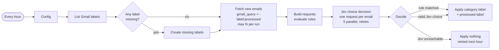

# Gmail AI Labeler for n8n: typed decisions instead of a chatbot

**Label your Gmail with a decision model instead of a chatbot: one typed decision per email, no broken JSON, about 1 second per email, and a fraction of a cent.**

[](https://n8n.io)
[](#requirements)
[%20via%20OpenRouter-6f42c1)](#the-typed-decision-idea)
[](LICENSE)

Türkçe: [README.tr.md](README.tr.md)

This is an n8n workflow that runs every hour. It picks up new Gmail messages and applies your own deterministic rules first. Every email that no rule matches gets a single **typed `choice` decision** from **Jev** (TypeSafe's decision model, served through OpenRouter). Then the workflow adds the category label and a "processed" marker label in Gmail.

It runs in production on a real personal inbox. It replaced a setup that sent one batched Gemini 2.5 Flash prompt for all new emails and parsed JSON out of the reply.

---

## Contents

- [Why this exists](#why-this-exists)
- [The typed-decision idea](#the-typed-decision-idea)
- [How it works](#how-it-works)
- [Features](#features)
- [Requirements](#requirements)
- [Quick start](#quick-start)
- [Writing good category criteria](#writing-good-category-criteria-the-biggest-quality-lever)
- [Rules](#rules)
- [Evaluation](#evaluation-one-real-inbox-not-a-benchmark)
- [Cost](#cost)
- [Plain-LLM mode](#plain-llm-mode-engine-llm)
- [Lessons learned in production](#lessons-learned-in-production)
- [Troubleshooting / FAQ](#troubleshooting--faq)
- [Limitations](#limitations)
- [Roadmap](#roadmap)

---

## Why this exists

Most "AI Gmail labeler" workflows ask a chat model to reply with some JSON that holds a category name. In practice that means:

- **Broken output.** Sometimes the reply is invalid JSON, gets wrapped in a code fence, or has a sentence in front of it.
- **Invented categories.** You define `Promotions` and the model answers `Newsletter` or `Marketing/Promo`, so no label matches.
- **Batch cross-talk.** To save money, people send 20 emails in one prompt. One odd email can shift the answers for the others, and one malformed reply loses the whole batch.

A **decision model** avoids all three problems. Jev does not generate text. You give it a *state* (the email) and a *question* with a fixed set of options and criteria. It returns one of those options with probabilities. Since it cannot write free text, it cannot break the format or make up a category. This workflow sends one small request per email, so each decision is independent.

## The typed-decision idea

Jev supports three question types:

| Type | You provide | You get back |
|---|---|---|
| `noul` | a yes/no question (criteria for `true` / `false`) | the probability that the answer is true |
| `choice` | up to 255 named options, each with criteria | `choice` + per-option `probabilities` + `confidence` |
| `score` | 2 to 10 ordered levels | a weighted score over the levels |

This workflow uses one `choice` question per email.

**Request:** `POST https://openrouter.ai/api/alpha/decisions` (authenticated with your OpenRouter API key)

```json
{
  "model": "typesafe/jev-1.13",
  "state": {
    "from": "shipping@example.com",
    "subject": "Your order is on its way",
    "snippet": "Good news! Your parcel has left our warehouse. Track your delivery with the link below."
  },
  "questions": {
    "category": {
      "type": "choice",
      "instructions": "Classify this email received in a personal Gmail inbox into exactly one category. Decide by what the email is about and why it was sent, not only by who sent it.",
      "criteria": {
        "Shopping & Deliveries": "Shopping, food delivery and marketplaces: orders, purchase receipts, shipment tracking, courier and postal services",
        "Promotions": "Marketing from ANY company: discounts, campaigns, newsletters, product updates and feature announcements",
        "Subscriptions & Services": "Transactional messages about the user's own subscriptions and service accounts: receipts, renewals, plan changes. Not newsletters or product updates.",
        "Other": "Personal or miscellaneous emails that do not clearly fit any category"
      }
    }
  }
}
```

**Response.** The structure is real, but *the values below are only illustrative*:

```json
{
  "model": "typesafe/jev-1.13-...",
  "answers": {
    "category": {
      "type": "choice",
      "choice": "Shopping & Deliveries",
      "probabilities": { "Shopping & Deliveries": 0.95, "Promotions": 0.03, "Subscriptions & Services": 0.01, "Other": 0.01 },
      "confidence": 0.95
    }
  },
  "usage": { "input_tokens": 230, "output_tokens": 12, "cost": 0.00000966 },
  "id": "gen-dec-...",
  "provider": "TypeSafe"
}
```

The workflow reads `answers.category.choice`, keeps `confidence` and `usage.cost` for your execution log, and ignores anything that is not one of your category names. That last check is defensive only, because a `choice` answer is always one of the options.

To try it from a terminal before you touch n8n:

```bash
curl -s https://openrouter.ai/api/alpha/decisions \
  -H "Authorization: Bearer $OPENROUTER_API_KEY" \
  -H "Content-Type: application/json" \
  -d @examples/jev-request.json
```

Jev at a glance: about 0.3 to 0.8 s per call, **$0.042 per million input tokens, output free**, 32k context, text input only.

## How it works



1. **Every Hour** (cron `0 */1 * * *`) starts the run. **Config** holds everything you can customize.
2. **List Labels → Find Missing Labels → Create Label** make sure every category label, every rule target label and the processed label exist in Gmail. Parents of nested `Parent/Child` labels are created first.
3. **Fetch New Emails** runs `gmail_query` plus `-label:<processed_label>`. With the defaults that is `newer_than:2d -category:promotions -category:social -label:ai-labeled`, and it returns at most `max_emails_per_run` messages (default 20).
4. **Build Requests** extracts the sender address, the subject (first 150 characters) and Gmail's snippet (first 150 characters). It evaluates your **rules** and builds one Jev request per email.
5. **Classify Email** (HTTP Request) sends the requests in batches of 5 every 200 ms. It has a 30 s timeout and 3 tries 2 s apart. If the call still fails, the workflow continues without an answer for that email.
6. **Decide Labels** uses the rule result if a rule matched, and Jev's choice otherwise, then resolves the Gmail label IDs. **If there is no valid answer, the email is skipped.** It never gets the processed label, so the next hourly run tries it again.
7. **Apply Labels** adds the category label and the processed label to the message.

## Features

- **One typed decision per email.** The category is always one of yours: no JSON parsing, no invented labels, no batch cross-talk.
- **Rules run before the model.** Use `contains` or `regex` on sender, subject or snippet for cases you know for certain, such as your own automation address or your employer.
- **Labels are created for you**, including nested labels and an optional `label_prefix` such as `AI/`.
- **Safe to fail.** If the model is unreachable, the workflow applies nothing and retries next hour. Emails that already have the processed label are never classified twice.
- **Rate limited and retried.** Requests go out 5 at a time, 200 ms apart, with 3 tries each.
- **You can see what it did.** Each labeled email shows `category`, `source` (`rule` / `jev` / `llm`), `confidence` and `cost` in the **Decide Labels** output.
- **All settings live in Config.** Categories, criteria, rules, query and limits are plain JSON. There are ready-made sets for a [freelancer](examples/categories-freelancer.json) and a [small business](examples/categories-small-business.json).
- **Optional plain-LLM mode** (`engine: "llm"`) for people who cannot use the alpha decisions endpoint.

## Requirements

- **n8n 2.x, self-hosted.** It was built on the Docker image `n8nio/n8n:latest`. It probably works on recent 1.x releases too, but it was not tested there. It needs no community nodes, no extra environment variables and no mounted folders.
- **A Gmail account** and a Gmail OAuth2 credential in n8n. See the [n8n Google OAuth docs](https://docs.n8n.io/integrations/builtin/credentials/google/oauth-single-service/).
- **An OpenRouter API key** with access to the Jev decisions endpoint (`/api/alpha/decisions`) and some credit. If you cannot access it, use [plain-LLM mode](#plain-llm-mode-engine-llm).
- Optional: set `GENERIC_TIMEZONE` for your n8n instance, or the workflow's timezone in its settings. The schedule runs at minute 0 of every hour, so the timezone only changes how execution times are shown.

## Quick start

### 1. Import

In n8n, go to **Workflows → Import from File** and select [`workflows/gmail-ai-labeler.json`](workflows/gmail-ai-labeler.json).

### 2. Credentials

| Credential type (n8n) | Used by | How to get it |
|---|---|---|
| **Gmail OAuth2 API** | `List Labels`, `Create Label`, `Fetch New Emails`, `Apply Labels` | Create an OAuth client in Google Cloud with the Gmail API enabled, then connect it in n8n ([docs](https://docs.n8n.io/integrations/builtin/credentials/google/oauth-single-service/)). |
| **Header Auth** (generic credential) | `Classify Email` | Name: `Authorization`, Value: `Bearer YOUR_OPENROUTER_KEY`. Create the key at [openrouter.ai/keys](https://openrouter.ai/keys). |

The OpenRouter key is stored only in the n8n credential. It never appears in a node parameter.

### 3. Config

Open the **Config** node. It is a Set node in raw JSON mode, and every other node reads from it.

| Key | Default | Meaning |
|---|---|---|
| `processed_label` | `"ai-labeled"` | Marker label added to every email the workflow has labeled. The fetch query excludes it. **Use a simple name** (letters, digits, hyphens), because Gmail search has to match it. |
| `label_prefix` | `""` | Put in front of every category and rule label. For example, `"AI/"` nests them under an `AI` parent label. Leave empty for top-level labels. |
| `create_missing_labels` | `true` | Create missing labels automatically. If `false`, create them yourself; emails whose label does not exist are skipped and retried later. |
| `gmail_query` | `"newer_than:2d -category:promotions -category:social"` | Gmail search query. The workflow adds `-label:<processed_label>` itself. By default it skips Gmail's own Promotions and Social tabs to save calls. |
| `max_emails_per_run` | `20` | Upper limit of emails per hourly run. |
| `engine` | `"jev"` | `"jev"` uses the decisions endpoint. `"llm"` uses OpenRouter chat/completions with a JSON-schema answer. |
| `jev_model` | `"typesafe/jev-1.13"` | Jev model ID. |
| `llm_model` | `"google/gemini-2.5-flash"` | Used only when `engine` is `"llm"`. Any OpenRouter model that supports structured outputs will work. |
| `instructions` | *"Classify this email received in a personal Gmail inbox into exactly one category. Decide by what the email is about and why it was sent, not only by who sent it."* | The question text. Describe the inbox, for example *"the Gmail inbox of a freelance web developer"*. |
| `rules` | 3 examples with `example.com` addresses | Deterministic rules that run before the model. See [Rules](#rules). **Replace the examples.** |
| `categories` | 13 categories (below) | `[{ "name": "...", "criteria": "..." }]`. `name` becomes the Gmail label, and `criteria` tells the model when to pick it. Between 2 and 255 entries. |

The default categories are `Automation`, `Work`, `Bills`, `Banking`, `Shopping & Deliveries`, `Social`, `Promotions`, `Subscriptions & Services`, `Security`, `Government`, `Travel`, `Events & Tickets` and `Other`. Each one comes with detailed criteria that were refined on real mail. Read them in the Config node, then change them for your own inbox (see the next section).

Invalid configuration stops the run with a clear message as soon as there are emails to classify. Examples are a duplicate category name, a broken regex, or an unknown `engine`.

### 4. Test run

1. Click **Execute workflow**.
2. Check the **Classify Email** output. Each item should contain `answers.category.choice`. An `error` field there points to a credential or endpoint problem (see [Troubleshooting](#troubleshooting--faq)).
3. Check the **Decide Labels** output. You get one item per labeled email, with `category`, `source`, `confidence` and `cost`.
4. Open Gmail and confirm the new labels are there.

### 5. Activate

Turn the workflow on. From now on it runs every hour.

## Writing good category criteria (the biggest quality lever)

In production, **the category definitions mattered more than anything else.** Short definitions made Jev use `Subscriptions & Services` as a catch-all: newsletters, marketplace emails and security alerts all ended up there, and agreement was only about 84%. After the definitions were rewritten around the email types that actually arrive in that inbox, Jev reached the same level as the previous Gemini setup (see [Evaluation](#evaluation-one-real-inbox-not-a-benchmark)).

**Before** (the short definitions from the first attempt, translated and anonymized):

```json
{ "name": "Subscriptions & Services",
  "criteria": "Subscription and service accounts, payment receipts or service notices (Netflix, Spotify, YouTube, Apple, Adobe, GitHub, AWS, Cloudflare, Google, OpenAI etc.)" },
{ "name": "Promotions",
  "criteria": "Discounts, campaigns, newsletters, bulletins, marketing emails" }
```

**After** (what ships as the default):

```json
{ "name": "Subscriptions & Services",
  "criteria": "Transactional messages about the user's own subscriptions and service accounts: receipts, renewals, payment confirmations, plan or account changes, terms/policy updates, membership sign-ups (Netflix, Spotify, YouTube, Apple, Google Play, Adobe, GitHub, AWS, Cloudflare, Supabase, OpenAI). Not newsletters or product updates." },
{ "name": "Promotions",
  "criteria": "Marketing from ANY company: discounts, campaigns, newsletters, monthly/weekly digests, product updates, \"what's new\" and feature announcements, conference or event marketing, birthday greetings from brands, messages marked as advertising" }
```

What changed, and how to do the same for your inbox:

- **Define categories by why the email was sent, not by who sent it.** An email from GitHub can be a receipt, a security alert or a product newsletter. The after-version says *transactional … about the user's own account*, and *marketing from ANY company*.
- **Write "NOT here" clauses at the borders.** Examples are *"Not newsletters or product updates."* and *"Invoices for purchases or food orders are NOT here"* (in `Bills`).
- **Name the email types you actually receive:** "favourite-listing alerts", "birthday greetings from brands", "leaked secret alerts".
- **Decide the hard cases on purpose and write the decision down.** In production, all LinkedIn emails (job alerts included) go to `Social` because the criteria say so.
- **When a new type of email is misfiled, fix the definition first.** Add a rule only when the case is truly deterministic.
- Keep an `Other` category. A `choice` question always picks one option, so it needs a place for the leftovers.
- Criteria in English work fine for non-English email. In the evaluation inbox much of the mail was not in English.

## Rules

Rules run before the model, and the first match wins. Each rule is:

```json
{ "field": "from", "contains": "you@example.com", "category": "Automation" }
{ "field": "text", "regex": "\\b(YourCompany|Your Client Ltd)\\b", "category": "Work" }
```

| Key | Values |
|---|---|
| `field` | `from` (sender **address** only), `subject`, `snippet`, `text` (subject + snippet), `any` (address + subject + snippet) |
| `contains` | case-insensitive substring |
| `regex` | case-insensitive JavaScript regex. In JSON, escape the backslashes: `\\b` |
| `category` | label to apply (gets `label_prefix`). It does not have to be one of the model's categories. |

Typical uses: notifications from your own scripts or n8n (your own address → `Automation`), your employer's or clients' domains (→ `Work`), and order emails from your shop system. In the production workflow, emails from the owner's own address go to `Automation`, and emails that mention the employer's name in the subject or snippet go to `Work`.

Emails matched by a rule are still sent to the model. This keeps requests and responses aligned one-to-one, and costs about $0.00004 per email. If the model is down, the rule label is still applied.

## Evaluation (one real inbox, not a benchmark)

The author compared Jev with the previous version, **one batched Gemini 2.5 Flash prompt for all new emails**, on their own personal inbox. Treat this as a single honest data point, not a benchmark.

| Set | Jev (one decision per email) | Gemini (batched prompt) |
|---|---|---|
| Development set, 117 emails (used while rewriting the definitions) | **114** correct (97.4%) | **115** correct (98.3%) |
| Unseen validation set, 200 emails | **195** correct (97.5%) | **196** correct (98.0%) |

- The first attempt used short definitions and reached about **84% agreement**. Jev put newsletters, marketplace emails and security alerts under `Subscriptions & Services`. Rewriting the definitions (see above) closed the gap.
- The referee was **Gemini-based**, so it was **biased toward Gemini**. Treat the result as "on par", not "slightly worse".
- What Jev improved: no invalid JSON, no invented categories, one independent decision per email, about 1 s per decision.
- Hard cases that remain: LinkedIn job alerts (kept under `Social` on purpose), newsletters from job boards, and birthday emails from brands (defined as `Promotions`).

## Cost

Jev pricing: **$0.042 per 1M input tokens, output tokens are free.**

**Assumption:** about **1,000 input tokens per email** with the default 13 categories. The request is about 3,000 characters and most of it is the category criteria. At roughly 4 characters per token that is about 750 tokens; it is rounded up here to stay on the safe side. More categories or longer criteria mean more tokens.

| Scenario | Arithmetic | Cost |
|---|---|---|
| Per email | 1,000 × $0.042 / 1,000,000 | **$0.000042** (0.0042 ¢) |
| 100 emails/day for 30 days | 3,000 × $0.000042 | **≈ $0.13 / month** |
| Hard ceiling with the defaults (20 emails every hour) | 20 × 24 × 30 = 14,400 × $0.000042 | **≈ $0.60 / month** |

You do not have to trust the estimate. Every Jev response includes `usage.cost`, and the workflow copies it into the `cost` field of each **Decide Labels** item. In the owner's tests, `usage.cost` was exactly `input_tokens × $0.042 / 1M`. The Gmail API costs nothing but has quotas. OpenRouter's fees for buying credits are not included above.

In `llm` mode, cost depends on the model you choose. Input and output tokens are both billed at that model's OpenRouter price.

## Plain-LLM mode (`engine: "llm"`)

If you do not have access to the alpha decisions endpoint, set `engine` to `"llm"`. The same HTTP node and the same OpenRouter credential then call `https://openrouter.ai/api/v1/chat/completions` with:

- a system prompt built from `instructions` and your categories with their criteria,
- `response_format: json_schema` with `strict: true`, where `category` is an **enum of your category names**,
- `provider.require_parameters: true`, so OpenRouter routes only to providers that support structured outputs,
- `temperature: 0`.

The answer is parsed defensively. An answer that is not one of your categories is treated like "model unreachable": nothing is applied, and the email is retried next hour.

> This mode is **not used in production.** It was only tested offline with mocked responses. It still sends one request per email, but a chat model can in principle still produce an invalid answer, which the decisions endpoint rules out by design. Issues and PRs are welcome.

## Lessons learned in production

- **The definitions are the model.** The same model went from about 84% agreement to on-par with Gemini with no change except better category criteria. When something is misfiled, rewrite the definition first.
- **One decision per email beats one big prompt.** With a batched prompt, one strange email or one broken JSON reply affects the whole batch. Per-email decisions fail one at a time, and each takes about a second.
- **Mark processed emails only on success.** The processed label is the only state. Leaving it off after a failed call is the whole retry mechanism, and it needs no database. Keep the `newer_than:` window longer than your longest expected outage, because emails older than the window are not retried.
- **Let Gmail do the cheap part.** The default query skips Gmail's own Promotions and Social tabs. The `Promotions` and `Social` categories are still there for marketing and social emails that land in Primary.
- **Rules are for certainty, the model is for meaning.** The owner's own automation address and the employer's name are rules. Everything else is up to the model.
- **Some hard cases are policy, not accuracy.** "Is a LinkedIn job alert Social or Work?" has no right answer. Pick one and write it into the criteria.

## Troubleshooting / FAQ

**Classify Email returns 401.** The Header Auth credential is missing or wrong. The header name must be `Authorization` and the value `Bearer <key>`, with a space after `Bearer`. Also make sure the credential is selected on the node.

**Classify Email returns 403/404, or "model not found".** Your key may not have access to the alpha decisions endpoint, or the endpoint may have changed. Test with the `curl` command above. If you need it working right away, set `engine: "llm"`.

**The run finishes but nothing is labeled.** Open **Classify Email**. An `error` field on the items means the model call failed (the emails will be retried). If Classify Email looks fine, check **Create Label** for errors such as an invalid label name. The workflow skips emails whose label cannot be found, so that they are retried later.

**The same emails are processed every hour.** Gmail search does not match your `processed_label`. Use a simple lowercase name without spaces or special characters, and check that the label exists and appears on labeled emails.

**I changed my categories. How do I relabel old mail?** Only emails without the processed label that also match `gmail_query` are classified. To redo recent mail, remove the processed label from those emails in Gmail, and widen `newer_than:` for one run if you need to. Labels from the old category names stay in Gmail. Rename or delete them there.

**`Config.categories …` / `Config.rules[i] …` error.** The configuration check failed. The message tells you which entry is wrong.

**Gmail errors with 429 / "User-rate limit exceeded".** Lower `max_emails_per_run` or run less often. The defaults are far below Gmail's per-user limits.

**The Gmail credential stops working after about a week.** If your Google Cloud OAuth consent screen is in *Testing* status, Google expires refresh tokens after 7 days. Publish the app (it can remain unverified for personal use) and reconnect.

**Can one email get several categories?** No, a `choice` question picks exactly one. See the [roadmap](#roadmap).

## Limitations

- **Alpha endpoint.** `/api/alpha/decisions` is an alpha API on OpenRouter. Access, request shape and pricing may change.
- **Text only, and short text.** The model sees the sender address, the first 150 characters of the subject and Gmail's snippet (first 150 characters). It does not see the body, attachments or images.
- **One label per email**, applied to the message, not the whole thread.
- **Confidence is not used as a gate.** The top choice is always applied. `confidence` is only logged.
- **Retry window.** Emails that stay unlabeled longer than the `newer_than:` window (2 days by default) are not picked up again.
- **Gmail API quotas and OAuth.** These are the usual Gmail API limits. Very large inboxes need a larger `max_emails_per_run` or more frequent runs, and you should watch the quota.
- The evaluation numbers come from **one** personal inbox and a Gemini-based referee.

## Roadmap

- Optional confidence threshold → a `Needs review` label.
- Optional extra `noul` questions (for example "is this bulk mail?") to fine-tune borderline cases.
- An optional short body excerpt for emails whose snippet is empty.
- Multi-label mode: one `noul` question per label.

Ideas and PRs are welcome.

## Contributing

Issues and pull requests are welcome, especially better default criteria, category sets for other kinds of inboxes (put them in [`examples/`](examples/)), and reports from people running plain-LLM mode. Please never include real email addresses or email contents in issues.

## Related

Other n8n workflows from the same production setup: [n8n-grounded-blog-writer](https://github.com/bugraskl/n8n-grounded-blog-writer), [n8n-instagram-autopilot](https://github.com/bugraskl/n8n-instagram-autopilot), [n8n-instagram-reels-publisher](https://github.com/bugraskl/n8n-instagram-reels-publisher).

## License

[MIT](LICENSE)
