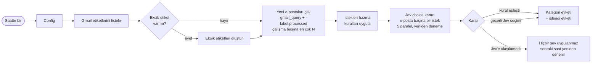

# n8n için Gmail AI Etiketleyici: sohbet botu değil, tipli karar modeli

**Gmail'inizi bir sohbet modeliyle değil, bir karar modeliyle etiketleyin: her e-posta için tek bir tipli karar, bozuk JSON yok, e-posta başına yaklaşık 1 saniye ve bir sentin çok küçük bir kısmı.**

[](https://n8n.io)
[](#gereksinimler)
[%20via%20OpenRouter-6f42c1)](#tipli-karar-fikri)
[](LICENSE)

English: [README.md](README.md)

Bu, saatte bir çalışan bir n8n iş akışıdır. Yeni Gmail iletilerini alır ve önce sizin belirlediğiniz kesin kuralları uygular. Hiçbir kurala uymayan her e-posta için **Jev**'den (TypeSafe'in karar modeli, OpenRouter üzerinden) tek bir **tipli `choice` kararı** ister. Ardından Gmail'de kategori etiketini ve bir "işlendi" işaret etiketini ekler.

Gerçek bir kişisel gelen kutusunda üretimde çalışıyor. Önceki kurulumun yerini aldı; o kurulum bütün yeni e-postaları tek bir toplu Gemini 2.5 Flash istemiyle gönderiyor ve yanıttaki JSON'u ayrıştırıyordu.

---

## İçindekiler

- [Neden var?](#neden-var)
- [Tipli karar fikri](#tipli-karar-fikri)
- [Nasıl çalışır?](#nasıl-çalışır)
- [Özellikler](#özellikler)
- [Gereksinimler](#gereksinimler)
- [Hızlı başlangıç](#hızlı-başlangıç)
- [Kategori ölçütü nasıl yazılır](#kategori-ölçütü-nasıl-yazılır-kalitenin-en-büyük-kaldıracı)
- [Kurallar](#kurallar)
- [Değerlendirme](#değerlendirme-tek-bir-gerçek-gelen-kutusu-benchmark-değil)
- [Maliyet](#maliyet)
- [Düz LLM modu](#düz-llm-modu-engine-llm)
- [Üretimden çıkan dersler](#üretimden-çıkan-dersler)
- [Sorun giderme / SSS](#sorun-giderme--sss)
- [Sınırlamalar](#sınırlamalar)
- [Yol haritası](#yol-haritası)

---

## Neden var?

"Yapay zekâ ile Gmail etiketleme" iş akışlarının çoğu bir sohbet modelinden, kategori adını içeren bir JSON ile yanıt vermesini ister. Pratikte bunun sonuçları şunlardır:

- **Bozuk çıktı.** Yanıt bazen geçersiz JSON olur, kod bloğuna sarılı gelir ya da başında bir açıklama cümlesi bulunur.
- **Uydurma kategori.** Siz `Promotions` tanımlarsınız, model `Newsletter` ya da `Marketing/Promo` der ve hiçbir etiket eşleşmez.
- **Toplu istekte karışma.** Para kazanmak için 20 e-posta tek istemde gönderilir. Tuhaf bir e-posta diğerlerinin yanıtlarını da kaydırabilir; tek bir bozuk yanıt da bütün grubu kaybettirir.

**Karar modeli** bu üç sorunun hepsini ortadan kaldırır. Jev metin üretmez. Ona bir *durum* (e-postayı) ve seçenekleri ile ölçütleri sabit bir *soru* verirsiniz. Size bu seçeneklerden birini olasılıklarıyla birlikte döndürür. Serbest metin yazamadığı için biçimi bozamaz, kategori de uyduramaz. Bu iş akışı her e-posta için ayrı ve küçük bir istek gönderir; böylece her karar birbirinden bağımsızdır.

## Tipli karar fikri

Jev üç soru tipini destekler:

| Tip | Siz verirsiniz | Size döner |
|---|---|---|
| `noul` | evet/hayır sorusu (`true` / `false` ölçütleri) | cevabın "doğru" olma olasılığı |
| `choice` | ölçütleriyle birlikte en çok 255 adlandırılmış seçenek | `choice` + seçenek başına `probabilities` + `confidence` |
| `score` | 2 ile 10 arası sıralı düzey | düzeyler üzerinde ağırlıklı puan |

Bu iş akışı her e-posta için bir `choice` sorusu kullanır.

**İstek:** `POST https://openrouter.ai/api/alpha/decisions` (OpenRouter API anahtarınızla kimlik doğrulanır)

```json
{
  "model": "typesafe/jev-1.13",
  "state": {
    "from": "shipping@example.com",
    "subject": "Your order is on its way",
    "snippet": "Good news! Your parcel has left our warehouse. Track your delivery with the link below."
  },
  "questions": {
    "category": {
      "type": "choice",
      "instructions": "Classify this email received in a personal Gmail inbox into exactly one category. Decide by what the email is about and why it was sent, not only by who sent it.",
      "criteria": {
        "Shopping & Deliveries": "Shopping, food delivery and marketplaces: orders, purchase receipts, shipment tracking, courier and postal services",
        "Promotions": "Marketing from ANY company: discounts, campaigns, newsletters, product updates and feature announcements",
        "Subscriptions & Services": "Transactional messages about the user's own subscriptions and service accounts: receipts, renewals, plan changes. Not newsletters or product updates.",
        "Other": "Personal or miscellaneous emails that do not clearly fit any category"
      }
    }
  }
}
```

**Yanıt.** Yapı gerçektir, ancak *aşağıdaki değerler yalnızca örnek amaçlıdır*:

```json
{
  "model": "typesafe/jev-1.13-...",
  "answers": {
    "category": {
      "type": "choice",
      "choice": "Shopping & Deliveries",
      "probabilities": { "Shopping & Deliveries": 0.95, "Promotions": 0.03, "Subscriptions & Services": 0.01, "Other": 0.01 },
      "confidence": 0.95
    }
  },
  "usage": { "input_tokens": 230, "output_tokens": 12, "cost": 0.00000966 },
  "id": "gen-dec-...",
  "provider": "TypeSafe"
}
```

İş akışı `answers.category.choice` değerini okur. `confidence` ile `usage.cost` değerlerini çalıştırma kaydında tutar ve kategori adlarınızdan biri olmayan her yanıtı yok sayar. Bu son kontrol yalnızca tedbir amaçlıdır; `choice` yanıtı zaten her zaman seçeneklerden biridir.

n8n'e geçmeden önce terminalden denemek için:

```bash
curl -s https://openrouter.ai/api/alpha/decisions \
  -H "Authorization: Bearer $OPENROUTER_API_KEY" \
  -H "Content-Type: application/json" \
  -d @examples/jev-request.json
```

Bir bakışta Jev: çağrı başına yaklaşık 0,3–0,8 sn, **milyon girdi token'ı başına 0,042 $, çıktı ücretsiz**, 32k bağlam, yalnızca metin girdisi.

## Nasıl çalışır?



1. **Every Hour** (cron `0 */1 * * *`) çalışmayı başlatır. Değiştirebileceğiniz her şey **Config** düğümündedir.
2. **List Labels → Find Missing Labels → Create Label** zinciri, her kategori etiketinin, her kural hedef etiketinin ve işlendi etiketinin Gmail'de var olmasını sağlar. İç içe `Üst/Alt` etiketlerde önce üst etiket oluşturulur.
3. **Fetch New Emails**, `gmail_query` ile `-label:<processed_label>` sorgusunu çalıştırır. Varsayılanlarla sorgu `newer_than:2d -category:promotions -category:social -label:ai-labeled` olur ve en çok `max_emails_per_run` ileti döner (varsayılan 20).
4. **Build Requests** gönderen adresini, konunun ilk 150 karakterini ve Gmail snippet'inin ilk 150 karakterini çıkarır. **Kuralları** uygular ve her e-posta için bir Jev isteği hazırlar.
5. **Classify Email** (HTTP Request) istekleri 200 ms arayla 5'erli gruplar hâlinde gönderir. 30 sn zaman aşımı vardır; bir istek 2 sn arayla en fazla 3 kez denenir. Çağrı yine de başarısız olursa iş akışı o e-posta için yanıtsız devam eder.
6. **Decide Labels** bir kural eşleştiyse kuralın sonucunu, eşleşmediyse Jev'in seçimini alır ve Gmail etiket kimliklerini bulur. **Geçerli bir yanıt yoksa e-posta atlanır.** İşlendi etiketi almadığı için bir sonraki saatlik çalışmada yeniden denenir.
7. **Apply Labels** kategori etiketini ve işlendi etiketini iletiye ekler.

## Özellikler

- **Her e-posta için tek bir tipli karar.** Kategori her zaman sizin tanımladıklarınızdan biridir: JSON ayrıştırma yok, uydurma etiket yok, toplu istek karışması yok.
- **Kurallar modelden önce çalışır.** Kesin bildiğiniz durumlar için gönderen, konu veya snippet üzerinde `contains` ya da `regex` kullanın; örneğin kendi otomasyon adresiniz ya da işvereniniz.
- **Etiketler sizin için oluşturulur**; iç içe etiketler ve isteğe bağlı `label_prefix` (ör. `AI/`) de buna dahildir.
- **Hata güvenli.** Modele ulaşılamazsa iş akışı hiçbir şey uygulamaz ve sonraki saat yeniden dener. İşlendi etiketi olan e-postalar asla ikinci kez sınıflandırılmaz.
- **Hız sınırı ve yeniden deneme.** İstekler 200 ms arayla 5'erli gider; her biri en çok 3 kez denenir.
- **Ne yaptığını görebilirsiniz.** Etiketlenen her e-posta için **Decide Labels** çıktısında `category`, `source` (`rule` / `jev` / `llm`), `confidence` ve `cost` görünür.
- **Bütün ayarlar Config'te.** Kategoriler, ölçütler, kurallar, sorgu ve sınırlar düz JSON'dur. [Serbest çalışan](examples/categories-freelancer.json) ve [küçük işletme](examples/categories-small-business.json) için hazır setler vardır.
- **İsteğe bağlı düz LLM modu** (`engine: "llm"`); alfa karar uç noktasını kullanamayanlar için.

## Gereksinimler

- **n8n 2.x, kendi sunucunuzda.** `n8nio/n8n:latest` Docker imajı üzerinde geliştirildi. Yakın tarihli 1.x sürümlerinde de büyük olasılıkla çalışır, ama orada denenmedi. Topluluk düğümü, ek ortam değişkeni ya da bağlanmış klasör gerektirmez.
- **Bir Gmail hesabı** ve n8n'de bir Gmail OAuth2 kimlik bilgisi. Bkz. [n8n Google OAuth belgeleri](https://docs.n8n.io/integrations/builtin/credentials/google/oauth-single-service/).
- Jev karar uç noktasına (`/api/alpha/decisions`) erişimi olan ve biraz kredisi bulunan **bir OpenRouter API anahtarı.** Erişiminiz yoksa [düz LLM modunu](#düz-llm-modu-engine-llm) kullanın.
- İsteğe bağlı: n8n için `GENERIC_TIMEZONE` ya da iş akışı ayarlarında saat dilimi. Zamanlama her saatin 0. dakikasında çalıştığı için saat dilimi yalnızca çalıştırma zamanlarının nasıl gösterildiğini değiştirir.

## Hızlı başlangıç

### 1. İçe aktarın

n8n'de **Workflows → Import from File** yolunu izleyin ve [`workflows/gmail-ai-labeler.json`](workflows/gmail-ai-labeler.json) dosyasını seçin.

### 2. Kimlik bilgileri

| Kimlik bilgisi türü (n8n) | Kullanan düğümler | Nasıl alınır |
|---|---|---|
| **Gmail OAuth2 API** | `List Labels`, `Create Label`, `Fetch New Emails`, `Apply Labels` | Google Cloud'da Gmail API'yi etkinleştirin, bir OAuth istemcisi oluşturun ve n8n'de bağlayın ([belgeler](https://docs.n8n.io/integrations/builtin/credentials/google/oauth-single-service/)). |
| **Header Auth** (genel kimlik bilgisi) | `Classify Email` | Name: `Authorization`, Value: `Bearer OPENROUTER_ANAHTARINIZ`. Anahtarı [openrouter.ai/keys](https://openrouter.ai/keys) adresinde oluşturun. |

OpenRouter anahtarı yalnızca n8n kimlik bilgisinde saklanır, hiçbir düğüm parametresinde görünmez.

### 3. Config

**Config** düğümünü açın. Ham JSON modunda bir Set düğümüdür ve diğer bütün düğümler ayarları buradan okur.

| Anahtar | Varsayılan | Anlamı |
|---|---|---|
| `processed_label` | `"ai-labeled"` | İş akışının etiketlediği her e-postaya eklenen işaret etiketi. Çekme sorgusu bu etiketi dışarıda bırakır. Gmail aramasının eşleştirebilmesi için **basit bir ad kullanın** (harf, rakam, tire). |
| `label_prefix` | `""` | Her kategori ve kural etiketinin başına eklenir. Örneğin `"AI/"` hepsini `AI` üst etiketinin altına koyar. Üst düzey etiketler için boş bırakın. |
| `create_missing_labels` | `true` | Eksik etiketleri otomatik oluşturur. `false` ise etiketleri kendiniz oluşturmalısınız; etiketi olmayan e-postalar atlanır ve daha sonra yeniden denenir. |
| `gmail_query` | `"newer_than:2d -category:promotions -category:social"` | Gmail arama sorgusu. İş akışı `-label:<processed_label>` kısmını kendisi ekler. Varsayılan olarak çağrı tasarrufu için Gmail'in kendi Promosyonlar ve Sosyal sekmelerini atlar. |
| `max_emails_per_run` | `20` | Saatlik çalışma başına en fazla e-posta sayısı. |
| `engine` | `"jev"` | `"jev"` karar uç noktasını kullanır. `"llm"` OpenRouter chat/completions ile JSON şemalı yanıt kullanır. |
| `jev_model` | `"typesafe/jev-1.13"` | Jev model kimliği. |
| `llm_model` | `"google/gemini-2.5-flash"` | Yalnızca `engine` değeri `"llm"` olduğunda kullanılır. Yapılandırılmış çıktıyı destekleyen her OpenRouter modeli çalışır. |
| `instructions` | *"Classify this email received in a personal Gmail inbox into exactly one category. Decide by what the email is about and why it was sent, not only by who sent it."* | Soru metni. Gelen kutusunu tarif edin, ör. *"the Gmail inbox of a freelance web developer"*. |
| `rules` | `example.com` adresli 3 örnek | Modelden önce çalışan kesin kurallar. Bkz. [Kurallar](#kurallar). **Örnekleri değiştirin.** |
| `categories` | 13 kategori (aşağıda) | `[{ "name": "...", "criteria": "..." }]`. `name` Gmail etiketi olur, `criteria` modele o kategoriyi ne zaman seçeceğini söyler. 2 ile 255 arası girdi. |

Varsayılan kategoriler şunlardır: `Automation`, `Work`, `Bills`, `Banking`, `Shopping & Deliveries`, `Social`, `Promotions`, `Subscriptions & Services`, `Security`, `Government`, `Travel`, `Events & Tickets` ve `Other`. Her birinin gerçek e-postalarla olgunlaştırılmış ayrıntılı ölçütü vardır. Config düğümünde okuyun, sonra kendi gelen kutunuza göre uyarlayın (sonraki bölüm). Etiket adları Türkçe olabilir; `name` alanına istediğinizi yazın.

Hatalı yapılandırma, sınıflandırılacak e-posta olduğu anda açık bir mesajla çalışmayı durdurur. Örnekler: aynı adlı iki kategori, bozuk bir regex ya da bilinmeyen bir `engine`.

### 4. Deneme çalıştırması

1. **Execute workflow** düğmesine basın.
2. **Classify Email** çıktısına bakın. Her öğede `answers.category.choice` bulunmalıdır. Orada bir `error` alanı görürseniz sorun kimlik bilgisinde ya da uç noktadadır ([Sorun giderme](#sorun-giderme--sss)).
3. **Decide Labels** çıktısına bakın. Etiketlenen her e-posta için `category`, `source`, `confidence` ve `cost` içeren bir öğe görürsünüz.
4. Gmail'i açın ve yeni etiketlerin geldiğini doğrulayın.

### 5. Etkinleştirin

İş akışını açın. Bundan sonra saatte bir çalışır.

## Kategori ölçütü nasıl yazılır (kalitenin en büyük kaldıracı)

Üretimde **kategori tanımları her şeyden daha önemli çıktı.** Kısa tanımlarla Jev, `Subscriptions & Services` kategorisini çöp kutusu gibi kullandı: bültenler, pazar yeri e-postaları ve güvenlik uyarıları oraya gitti; uyum yalnızca yaklaşık %84'tü. Tanımlar o gelen kutusuna gerçekten gelen e-posta türleri etrafında yeniden yazılınca Jev önceki Gemini kurulumuyla aynı düzeye geldi ([Değerlendirme](#değerlendirme-tek-bir-gerçek-gelen-kutusu-benchmark-değil)).

**Önce** (ilk denemedeki kısa tanımlar, çevrilmiş ve anonimleştirilmiş):

```json
{ "name": "Subscriptions & Services",
  "criteria": "Subscription and service accounts, payment receipts or service notices (Netflix, Spotify, YouTube, Apple, Adobe, GitHub, AWS, Cloudflare, Google, OpenAI etc.)" },
{ "name": "Promotions",
  "criteria": "Discounts, campaigns, newsletters, bulletins, marketing emails" }
```

**Sonra** (varsayılan olarak gelen hâli):

```json
{ "name": "Subscriptions & Services",
  "criteria": "Transactional messages about the user's own subscriptions and service accounts: receipts, renewals, payment confirmations, plan or account changes, terms/policy updates, membership sign-ups (Netflix, Spotify, YouTube, Apple, Google Play, Adobe, GitHub, AWS, Cloudflare, Supabase, OpenAI). Not newsletters or product updates." },
{ "name": "Promotions",
  "criteria": "Marketing from ANY company: discounts, campaigns, newsletters, monthly/weekly digests, product updates, \"what's new\" and feature announcements, conference or event marketing, birthday greetings from brands, messages marked as advertising" }
```

Neler değişti ve kendi gelen kutunuz için aynısını nasıl yaparsınız:

- **Kategoriyi e-postanın kimden geldiğine göre değil, neden gönderildiğine göre tanımlayın.** GitHub'dan gelen bir e-posta makbuz da olabilir, güvenlik uyarısı da, ürün bülteni de. Yeni tanım *"kullanıcının kendi hesabıyla ilgili işlemsel ileti"* ve *"HERHANGİ bir şirketten pazarlama"* der.
- **Sınırlara "burada DEĞİL" cümleleri yazın.** Örnekler: *"Not newsletters or product updates."* ve `Bills` kategorisindeki *"Invoices for purchases or food orders are NOT here"*.
- **Gerçekten aldığınız e-posta türlerini adıyla yazın:** "favori ilan bildirimleri", "markalardan doğum günü kutlamaları", "sızdırılmış gizli anahtar uyarıları".
- **Zor durumlara bilinçli karar verin ve kararı ölçüte yazın.** Üretimde bütün LinkedIn e-postaları (iş ilanları dahil), ölçüt öyle dediği için `Social` kategorisine gider.
- **Yeni bir e-posta türü yanlış yere düşerse önce tanımı düzeltin.** Kuralı yalnızca durum gerçekten kesinse ekleyin.
- Bir `Other` kategorisi tutun. `choice` sorusu her zaman bir seçenek seçer; artakalan e-postalar için bir yer gerekir.
- İngilizce ölçütler İngilizce olmayan e-postalarda da iyi çalışır. Değerlendirilen gelen kutusundaki e-postaların büyük kısmı İngilizce değildi.

## Kurallar

Kurallar modelden önce çalışır ve ilk eşleşen kazanır. Her kural şöyledir:

```json
{ "field": "from", "contains": "you@example.com", "category": "Automation" }
{ "field": "text", "regex": "\\b(YourCompany|Your Client Ltd)\\b", "category": "Work" }
```

| Anahtar | Değerler |
|---|---|
| `field` | `from` (yalnızca gönderen **adresi**), `subject`, `snippet`, `text` (konu + snippet), `any` (adres + konu + snippet) |
| `contains` | büyük/küçük harf duyarsız alt dize |
| `regex` | büyük/küçük harf duyarsız JavaScript regex'i. JSON içinde ters bölüleri kaçırın: `\\b` |
| `category` | uygulanacak etiket (`label_prefix` eklenir). Modelin kategorilerinden biri olmak zorunda değildir. |

Tipik kullanımlar: kendi betiklerinizden ya da n8n'den gelen bildirimler (kendi adresiniz → `Automation`), işvereninizin ya da müşterilerinizin alan adları (→ `Work`) ve mağaza sisteminizden gelen sipariş e-postaları. Üretimdeki iş akışında sahibinin kendi adresinden gelenler `Automation` etiketini, konu ya da snippet'te işverenin adı geçenler `Work` etiketini alır.

Kurala uyan e-postalar da modele gönderilir. Bu sayede istekler ve yanıtlar birebir hizalı kalır; maliyeti e-posta başına yaklaşık 0,00004 $'dır. Model çalışmıyorsa kural etiketi yine uygulanır.

## Değerlendirme (tek bir gerçek gelen kutusu, benchmark değil)

Üretimdeki iş akışının sahibi Jev'i önceki sürümle, yani **bütün yeni e-postalar için tek bir toplu Gemini 2.5 Flash istemiyle**, kendi kişisel gelen kutusunda karşılaştırdı. Bunu bir benchmark olarak değil, dürüst tek bir veri noktası olarak okuyun.

| Set | Jev (e-posta başına bir karar) | Gemini (toplu istem) |
|---|---|---|
| Geliştirme seti, 117 e-posta (tanımlar yeniden yazılırken kullanıldı) | **114** doğru (%97,4) | **115** doğru (%98,3) |
| Görülmemiş doğrulama seti, 200 e-posta | **195** doğru (%97,5) | **196** doğru (%98,0) |

- İlk deneme kısa tanımlarla yapıldı ve yaklaşık **%84 uyum** çıktı. Jev bültenleri, pazar yeri e-postalarını ve güvenlik uyarılarını `Subscriptions & Services` altına koydu. Tanımların yeniden yazılması (yukarıda) aradaki farkı kapattı.
- Hakem **Gemini tabanlıydı**, yani **Gemini lehine taraflıydı**. Sonucu "biraz geride" olarak değil, "başabaş" olarak okuyun.
- Jev'in getirdiği iyileşmeler: geçersiz JSON yok, uydurma kategori yok, her e-posta için bağımsız bir karar, karar başına yaklaşık 1 sn.
- Hâlâ zor olan durumlar: LinkedIn iş ilanları (bilerek `Social` altında tutuldu), iş ilanı sitelerinin bültenleri ve markaların doğum günü e-postaları (`Promotions` olarak tanımlandı).

## Maliyet

Jev fiyatı: **milyon girdi token'ı başına 0,042 $, çıktı token'ları ücretsiz.**

**Varsayım:** Varsayılan 13 kategoriyle **e-posta başına yaklaşık 1.000 girdi token'ı.** İstek yaklaşık 3.000 karakterdir ve çoğu kategori ölçütlerinden oluşur. Token başına kabaca 4 karakterle bu yaklaşık 750 token eder; burada güvenli tarafta kalmak için yukarı yuvarlandı. Daha çok kategori ya da daha uzun ölçüt, daha çok token demektir.

| Senaryo | Hesap | Maliyet |
|---|---|---|
| E-posta başına | 1.000 × 0,042 $ / 1.000.000 | **0,000042 $** (0,0042 sent) |
| 30 gün boyunca günde 100 e-posta | 3.000 × 0,000042 $ | **ayda ≈ 0,13 $** |
| Varsayılanlarla üst sınır (her saat 20 e-posta) | 20 × 24 × 30 = 14.400 × 0,000042 $ | **ayda ≈ 0,60 $** |

Bu tahmine güvenmek zorunda değilsiniz. Her Jev yanıtında `usage.cost` bulunur ve iş akışı bunu her **Decide Labels** öğesindeki `cost` alanına kopyalar. Sahibinin denemelerinde `usage.cost` tam olarak `input_tokens × 0,042 $ / 1M` çıktı. Gmail API ücretsizdir ama kotası vardır. OpenRouter'ın kredi satın alırken aldığı ücretler yukarıdaki hesaba dahil değildir.

`llm` modunda maliyet seçtiğiniz modele bağlıdır. Hem girdi hem çıktı token'ları o modelin OpenRouter fiyatından ücretlendirilir.

## Düz LLM modu (`engine: "llm"`)

Alfa karar uç noktasına erişiminiz yoksa `engine` değerini `"llm"` yapın. Aynı HTTP düğümü ve aynı OpenRouter kimlik bilgisi bu durumda `https://openrouter.ai/api/v1/chat/completions` adresini şu ayarlarla çağırır:

- `instructions` ile kategorilerinizden ve ölçütlerinden kurulan bir sistem istemi,
- `strict: true` ile `response_format: json_schema`; burada `category` **kategori adlarınızdan oluşan bir enum**'dur,
- `provider.require_parameters: true`; böylece OpenRouter isteği yalnızca yapılandırılmış çıktıyı destekleyen sağlayıcılara yönlendirir,
- `temperature: 0`.

Yanıt temkinli biçimde ayrıştırılır. Kategorilerinizden biri olmayan bir yanıt "modele ulaşılamadı" gibi değerlendirilir: hiçbir şey uygulanmaz ve e-posta sonraki saat yeniden denenir.

> Bu mod **üretimde kullanılmıyor.** Yalnızca taklit yanıtlarla çevrimdışı test edildi. Yine e-posta başına bir istek gönderir, ama bir sohbet modeli ilke olarak geçersiz yanıt üretebilir; karar uç noktası ise bunu tasarımı gereği engeller. Issue ve PR'lar memnuniyetle karşılanır.

## Üretimden çıkan dersler

- **Tanımlar modelin kendisidir.** Aynı model, yalnızca kategori ölçütleri iyileştirilerek yaklaşık %84 uyumdan Gemini ile başabaş düzeye geldi. Bir e-posta yanlış yere düşerse önce tanımı yeniden yazın.
- **E-posta başına bir karar, tek büyük istemden iyidir.** Toplu istemde tek bir tuhaf e-posta ya da bozuk bir JSON yanıtı bütün grubu etkiler. E-posta başına kararlar birer birer başarısız olur ve her biri yaklaşık bir saniye sürer.
- **Yalnızca başarılı olunca "işlendi" deyin.** İşlendi etiketi tek durum bilgisidir. Başarısız bir çağrıdan sonra etiketi koymamak, veritabanı gerektirmeyen yeniden deneme mekanizmasının kendisidir. `newer_than:` penceresini beklediğiniz en uzun kesintiden uzun tutun; pencereden daha eski e-postalar yeniden denenmez.
- **Ucuz işi Gmail'e bırakın.** Varsayılan sorgu Gmail'in kendi Promosyonlar ve Sosyal sekmelerini atlar. `Promotions` ve `Social` kategorileri yine de Birincil sekmeye düşen pazarlama ve sosyal e-postalar için vardır.
- **Kurallar kesinlik içindir, model anlam içindir.** Sahibin kendi otomasyon adresi ve işverenin adı kuraldır. Geri kalan her şeye model karar verir.
- **Bazı zor durumlar doğruluk değil, tercih meselesidir.** "LinkedIn iş ilanı Sosyal mi, İş mi?" sorusunun doğru bir cevabı yoktur. Birini seçin ve ölçüte yazın.

## Sorun giderme / SSS

**Classify Email 401 döndürüyor.** Header Auth kimlik bilgisi eksik ya da yanlış. Başlık adı `Authorization`, değeri `Bearer <anahtar>` olmalı; `Bearer` sözcüğünden sonra bir boşluk bulunmalı. Kimlik bilgisinin düğümde seçili olduğundan da emin olun.

**Classify Email 403/404 ya da "model not found" döndürüyor.** Anahtarınızın alfa karar uç noktasına erişimi olmayabilir ya da uç nokta değişmiş olabilir. Yukarıdaki `curl` komutuyla deneyin. Hemen çalışması gerekiyorsa `engine: "llm"` ayarını kullanın.

**Çalışma bitiyor ama hiçbir şey etiketlenmiyor.** **Classify Email** çıktısını açın. Öğelerde bir `error` alanı varsa model çağrısı başarısız olmuştur (e-postalar yeniden denenecek). Classify Email iyi görünüyorsa **Create Label** çıktısında geçersiz etiket adı gibi hatalar olup olmadığına bakın. İş akışı etiketi bulunamayan e-postaları, sonra yeniden denenmeleri için atlar.

**Aynı e-postalar her saat yeniden işleniyor.** Gmail araması `processed_label` adını eşleştiremiyor. Boşluk ya da özel karakter içermeyen, küçük harfli basit bir ad kullanın; etiketin var olduğunu ve etiketlenen e-postalarda göründüğünü kontrol edin.

**Kategorilerimi değiştirdim; eski e-postaları nasıl yeniden etiketlerim?** Yalnızca işlendi etiketi olmayan ve `gmail_query` ile eşleşen e-postalar sınıflandırılır. Yakın tarihli e-postaları yeniden işlemek için Gmail'de bu e-postalardan işlendi etiketini kaldırın; gerekirse bir çalışmalık `newer_than:` penceresini genişletin. Eski kategori adlarının etiketleri Gmail'de kalır; onları orada yeniden adlandırın ya da silin.

**`Config.categories …` / `Config.rules[i] …` hatası.** Yapılandırma kontrolü başarısız oldu. Mesaj hangi girdinin hatalı olduğunu söyler.

**Gmail 429 / "User-rate limit exceeded" hatası.** `max_emails_per_run` değerini düşürün ya da daha seyrek çalıştırın. Varsayılanlar Gmail'in kullanıcı başına sınırlarının çok altındadır.

**Gmail kimlik bilgisi bir hafta sonra çalışmayı bırakıyor.** Google Cloud OAuth izin ekranınız *Testing* durumundaysa Google yenileme token'larını 7 gün sonra geçersiz kılar. Uygulamayı yayınlayın (kişisel kullanım için doğrulanmamış kalabilir) ve yeniden bağlayın.

**Bir e-posta birden çok kategori alabilir mi?** Hayır, `choice` sorusu tam olarak bir seçenek seçer. Bkz. [yol haritası](#yol-haritası).

## Sınırlamalar

- **Alfa uç nokta.** `/api/alpha/decisions` OpenRouter'da bir alfa API'dir. Erişim, istek biçimi ve fiyat değişebilir.
- **Yalnızca metin, üstelik kısa metin.** Model gönderen adresini, konunun ilk 150 karakterini ve Gmail snippet'ini (ilk 150 karakter) görür. Gövdeyi, ekleri ya da görselleri görmez.
- **E-posta başına tek etiket**; etiket iş parçacığının tamamına değil, iletiye uygulanır.
- **Güven değeri bir eşik olarak kullanılmaz.** En yüksek olasılıklı seçim her zaman uygulanır; `confidence` yalnızca kaydedilir.
- **Yeniden deneme penceresi.** `newer_than:` penceresinden (varsayılan 2 gün) daha uzun süre etiketsiz kalan e-postalar bir daha alınmaz.
- **Gmail API kotaları ve OAuth.** Bunlar olağan Gmail API sınırlarıdır. Çok büyük gelen kutuları için daha büyük bir `max_emails_per_run` ya da daha sık çalıştırma gerekir; bu durumda kotayı izleyin.
- Değerlendirme sayıları **tek** bir kişisel gelen kutusundan ve Gemini tabanlı bir hakemden gelir.

## Yol haritası

- İsteğe bağlı güven eşiği → `Needs review` etiketi.
- Sınırdaki durumları iyileştirmek için isteğe bağlı ek `noul` soruları (ör. "bu toplu bir e-posta mı?").
- Snippet'i boş olan e-postalar için isteğe bağlı kısa bir gövde alıntısı.
- Çoklu etiket modu: etiket başına bir `noul` sorusu.

Fikirler ve PR'lar memnuniyetle karşılanır.

## Katkı

Issue ve pull request'ler memnuniyetle karşılanır; özellikle daha iyi varsayılan ölçütler, başka tür gelen kutuları için kategori setleri ([`examples/`](examples/) klasörüne) ve düz LLM modunu kullananlardan gelen geri bildirimler. Lütfen issue'lara asla gerçek e-posta adresleri ya da e-posta içerikleri koymayın.

## İlgili

Aynı üretim ortamından diğer n8n iş akışları: [n8n-grounded-blog-writer](https://github.com/bugraskl/n8n-grounded-blog-writer), [n8n-instagram-autopilot](https://github.com/bugraskl/n8n-instagram-autopilot), [n8n-instagram-reels-publisher](https://github.com/bugraskl/n8n-instagram-reels-publisher).

## Lisans

[MIT](LICENSE)
